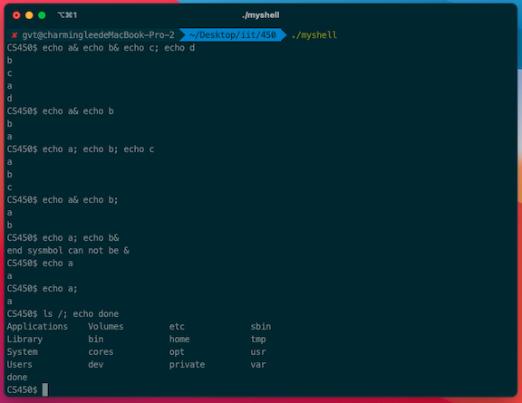

# CS450 README

## introduce:
This is IIT F21 CS450 Assignment 1

---

## how to build and execute?
### build script:
```shell
gcc myshell.c -o myshell
```
### execute at current document:
```shell
./myshell
```
---
## for example:


---
## explains how my code works:
### 1.I modified the getcmd function, use “$CS450” for the prompt. as follows
```c
int getcmd(char *buf, int nbuf) {

    if (isatty(fileno(stdin)))
        fprintf(stdout, "CS450$ ");
    memset(buf, 0, nbuf);
    fgets(buf, nbuf, stdin);
    if (buf[0] == 0) // EOF
        return -1;
    return 0;
}
```

### 2.check end symbol
   
I added a check to see if the symbol is in the last digit in the parsecmd function.
   
##### this is checkEndSymbol function:
```c
char whitespace[] = " \t\r\n\v";
int checkEndSymbol(char *strIn) {
    static char tag1 = '&';
    int i = strlen(strIn) - 1;
    while (i > 0 && strchr(whitespace, strIn[i])) {
        i--;
    }

    if (i > 0 && strIn[i] == tag1) {
        return 1;
    }

    return 0;
}
```
##### call the checkEndSymbol function at parsecmd function:
```c
struct cmd *parsecmd(char *s) {
    if (checkEndSymbol(s)) {
        fprintf(stderr, "end sysmbol can not be &\n");
        exit(-1);
    }
    char *es;
    struct cmd *cmd;
    es = s + strlen(s);
    cmd = parseline(&s, es);
    peek(&s, es, "");
    if (s != es) {
        fprintf(stderr, "leftovers: %s\n", s);
        exit(-1);
    }
    return cmd;
}
```

### 3. implemented '&' and ';' symbol make commands can be executed parallel and Serial.

1. function parseexec add '&' and ';' when call peek,then achieved the division of commands.
```c
struct cmd *parseexec(char **ps, char *es) {
    char *q, *eq;
    int tok, argc;
    struct execcmd *cmd;
    struct cmd *ret;

    ret = execcmd();
    cmd = (struct execcmd *) ret;

    argc = 0;
    ret = parseredirs(ret, ps, es);
    while (!peek(ps, es, "|&;")) {
        if ((tok = gettoken(ps, es, &q, &eq)) == 0)
            break;
        if (tok != 'a') {
            fprintf(stderr, "syntax error\n");
            exit(-1);
        }
        cmd->argv[argc] = mkcopy(q, eq);
        argc++;
        if (argc >= MAXARGS) {
            fprintf(stderr, "too many args\n");
            exit(-1);
        }
        ret = parseredirs(ret, ps, es);
    }
    cmd->argv[argc] = 0;
    return ret;
}
```


2. I designed a listcmd, where I defined a structure with a type field to indicate the type and used the structure cmd to define the left and right fields to connect two cmd, similar to a linked list. 
```c
struct listcmd {
    int type;          // & ;
    struct cmd *left;  // left side of pipe
    struct cmd *right; // right side of pipe
};
```
3. Use the listcmd function to build struct listcmd in the parseline function.
```c
struct cmd *parseline(char **ps, char *es) {
    struct cmd *cmd;
    cmd = parsepipe(ps, es);
    if(peek(ps, es, ";")){
        gettoken(ps, es, 0, 0);
        cmd = listcmd(';', cmd, parseline(ps, es));
    }
    if(peek(ps, es, "&")){
        gettoken(ps, es, 0, 0);
        cmd = listcmd('&', cmd, parseline(ps, es));
    }
    return cmd;
}
```

##### listcmd function
```c
struct cmd* listcmd(char type, struct cmd *left, struct cmd *right)
{
    struct listcmd *cmd;

    cmd = malloc(sizeof(*cmd));
    memset(cmd, 0, sizeof(*cmd));
    cmd->type = type;
    cmd->left = left;
    cmd->right = right;
    return (struct cmd*)cmd;
}
```

4. Add support for symbols ';' and '&' in the runcmd function and fork child process execute command Line, then call wait function when lcmd type is ';'.
```c
void runcmd(struct cmd *cmd) {
    int p[2], r;
    struct execcmd *ecmd;
    struct pipecmd *pcmd;
    struct redircmd *rcmd;
    struct listcmd *lcmd;

    if (cmd == 0)
        exit(0);

    switch (cmd->type) {
        default:
            fprintf(stderr, "unknown runcmd\n");
            exit(0);
        case ' ':
            ecmd = (struct execcmd *) cmd;
            if (ecmd->argv[0] == 0)
                exit(0);
            //fprintf(stdout, "exec not implemented\n");
            execvp(ecmd->argv[0], &ecmd->argv[0]);
            break;
        case '>':
        case '<':
            rcmd = (struct redircmd *) cmd;
            fprintf(stderr, "redir not implemented\n");
            // Your code here ...
            runcmd(rcmd->cmd);
            break;
        case '|':
            pcmd = (struct pipecmd *) cmd;
            fprintf(stderr, "pipe not implemented\n");
            // Your code here ...
            break;
        case '&':
        case ';':
            lcmd = (struct listcmd *) cmd;
            if(fork1() == 0)
                runcmd(lcmd->left);
            if (lcmd->type == ';') {
                wait(0);
            }
            runcmd(lcmd->right);
            break;
    }
    exit(0);
}
```