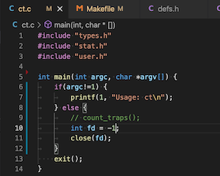
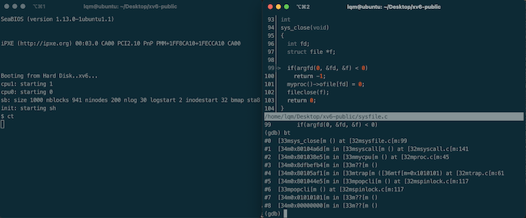
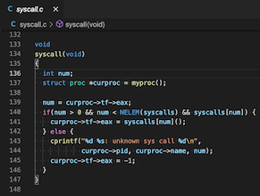
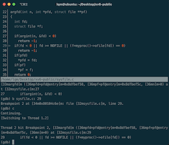
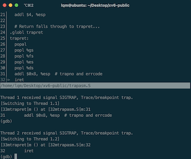

# Trace the close() system call

## step 1:
I define system call ct to trace close() and set the parameter fd, but fd is non-existing file.

## step 2:

### step 2.1:
Add a breakpoint to sys_close in gdb and execute ct.Looking at the backtrace, we can see that sys_close is called from the 141 line of code in syscall.c .Next,in step 2.2,let's take a look at what the 141 lines of code in the syscall.c file do.

### step 2.2:
At line 141, the registered system call is obtained from array syscalls, because sys_close is registered as 21, so here num is 21.

## step 3:
The sys_close function executes to line 99 and enters the argfd function. After the argfd function executes to line 29, it is found that fd does not exist and then into trap.c, like step 4.

## step 4:
The fd does not exist to fall into the trap

## step 5:
Finally, execute the trapret assembly instructions in trapasm.S to addl trapno and errcode

