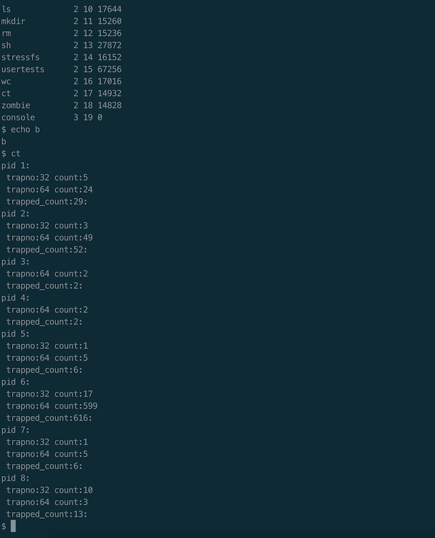

# TEST CASE
To test count_traps() we build a ct command and execute the ct command will print the number of times that each process executed by the system has fallen into os and the type of trap.

First build the following code.

ct.c
```c
#include "types.h"
#include "stat.h"
#include "user.h"

int main(int argc, char *argv[]) {
	if(argc!=1)
	    printf(1, "Usage: ct\n");
	else
        count_traps();
    exit();
}
```

Then add "_ct" to UPROGS and ct.c to EXTRA of Makefile
```makefile
UPROGS=\
	_cat\
	_echo\
	_forktest\
	_grep\
	_init\
	_kill\
	_ln\
	_ls\
	_mkdir\
	_rm\
	_sh\
	_stressfs\
	_usertests\
	_wc\
	_ct\
	_zombie\


EXTRA=\
	mkfs.c ulib.c user.h cat.c echo.c forktest.c grep.c kill.c\
	ln.c ls.c mkdir.c rm.c stressfs.c usertests.c wc.c ct.c zombie.c\
	printf.c umalloc.c\
	README dot-bochsrc *.pl toc.* runoff runoff1 runoff.list\
	.gdbinit.tmpl gdbutil\
```
After executing some commands, execute ct to view the trap information of the process
